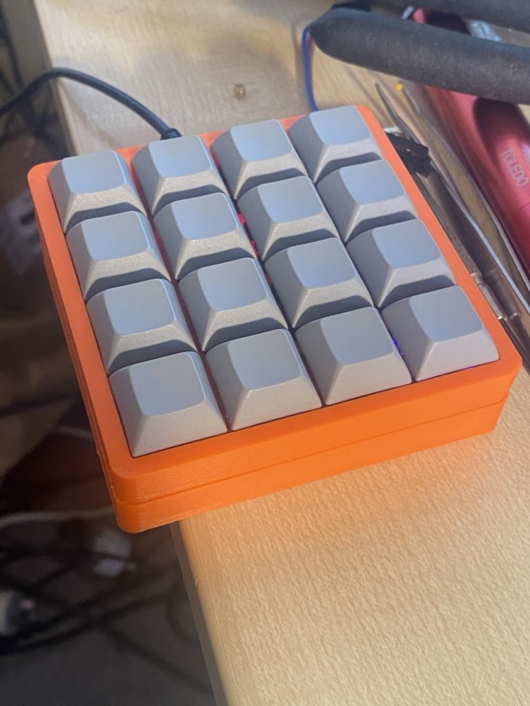
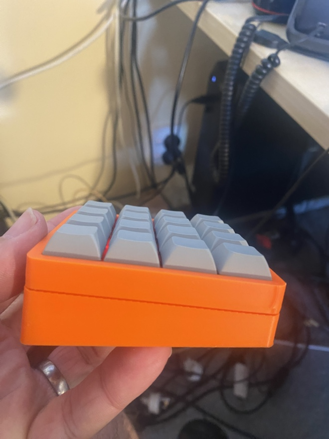
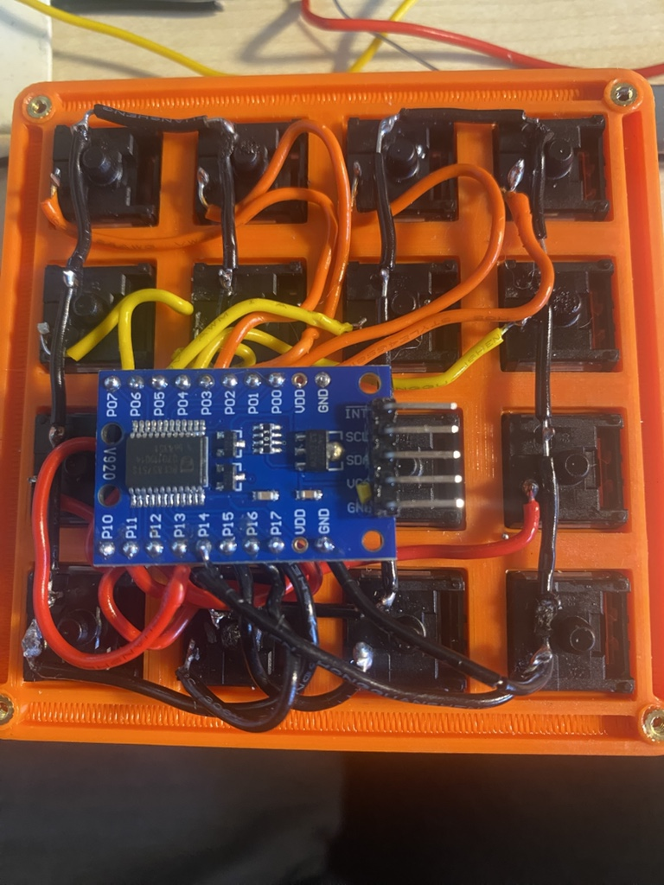

# Pro Micro + PCF8575 4x4 Keypad (Interrupt Driven)

## 📖 Overview

This project demonstrates how to interface a **4×4 matrix keypad** with an **Arduino Pro Micro (ATmega32U4)** using a **PCF8575 16-bit I²C I/O expander**.






Key features:

* Interrupt-driven key detection (no constant polling)
* Debounced input handling
* Serial output of pressed keys
* Expandable to USB HID (keyboard/media control)

---

## 🔧 Hardware Requirements

* Arduino Pro Micro (ATmega32U4)
* PCF8575 I/O Expander module
* 4×4 Matrix Keypad
* Jumper wires
* (Recommended) 4.7kΩ pull-up resistors for SDA/SCL

---

## 🔌 Wiring

### PCF8575 → Pro Micro

| PCF8575 | Pro Micro |
| ------- | --------- |
| VCC     | VCC       |
| GND     | GND       |
| SDA     | Pin 2     |
| SCL     | Pin 3     |
| INT     | Pin 7     |

### Keypad → PCF8575

| Keypad | PCF8575 |
| ------ | ------- |
| Rows   | P0–P3   |
| Cols   | P4–P7   |

---

## 📦 Dependencies

Install via Arduino Library Manager:

* **PCF8575 library (by xreef / Renzo Mischianti)**

---

## 🚀 Features

* Uses I²C for minimal pin usage
* Interrupt pin triggers only on key press
* Software debounce implemented
* Prevents repeated key spam (wait-for-release)

---

## 🧠 How It Works

1. All PCF8575 pins are set HIGH (inputs with pull-ups)
2. A key press connects a row to a column (pulls LOW)
3. PCF8575 triggers the INT pin
4. Arduino interrupt fires
5. Keypad scan identifies row/column
6. Key is printed to Serial

---

## 🖥️ Serial Output Example

```
Keypad ready...
Key pressed: 1
Key pressed: A
Key pressed: 5
```

---

## ⚙️ Configuration

### webinterface


### I²C Address

Default:

```
0x20
```

Change depending on A0–A2 pins on PCF8575.

---

### Debounce Timing

Adjust in code:

```cpp
const unsigned long debounceDelay = 50;
```

---

## 🛠️ Troubleshooting

### PCF8575 init failed

* Check wiring (SDA/SCL swapped is common)
* Confirm address with I²C scanner
* Ensure pull-up resistors are present

### No key detected

* Verify keypad wiring (rows vs columns)
* Check PCF8575 pin mapping

### Multiple triggers / bouncing

* Increase debounce delay (e.g. 50 → 100 ms)

---

## 🔮 Future Improvements

* USB HID keyboard support
* Media key control (volume, mute, etc.)
* EEPROM-based key mapping
* Multi-key detection
* Long press / hold detection

---

## 📜 License

MIT License — feel free to use and modify.

---

## 🙌 Acknowledgements

* Arduino community
* PCF8575 library contributors

---
